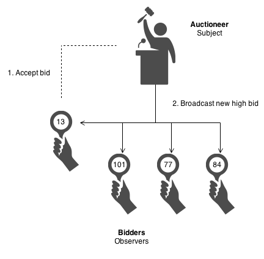

# Observer Design Pattern

## Problem

A large monolithic design does not scale well as new graphing or monitoring requirements are levied.

## Intent

- Define a one-to-many dependency between objects so that when one object changes state, all its dependents are notified and updated automatically.
- Encapsulate the core (or common or engine) components in a Subject abstraction, and the variable (or optional or user interface) components in an Observer hierarchy.
- The "View" part of Model-View-Controller.

## Structure

  

Subject represents the core (or independent or common or engine) abstraction. Observer represents the variable (or dependent or optional or user interface) abstraction. The Subject prompts the Observer objects to do their thing. Each Observer can call back to the Subject as needed.

## Example

The Observer defines a one-to-many relationship so that when one object changes state, the others are notified and updated automatically. Some auctions demonstrate this pattern. Each bidder possesses a numbered paddle that is used to indicate a bid. The auctioneer starts the bidding, and "observes" when a paddle is raised to accept the bid. The acceptance of the bid changes the bid price which is broadcast to all of the bidders in the form of a new bid.

  

## Task

Implement a simple parser that accepts the list of Slovenian taxpayers as text (for legal entities) and creates objects of the Taxpayer class from the read data. Implement the parser according to the planning pattern of the observer, which means that the parser must trigger an event about the read taxpayer for each line read and also inform the observers about it. Your parser should also allow you to log events in the event of syntax errors in a text file.